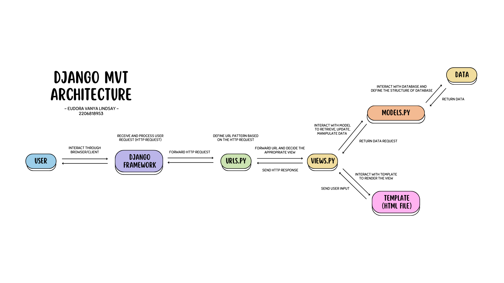

# **BOOK CATALOG**
https://book-catalog.adaptable.app

---

## How I implement the checklists step by step
<details>
<summary> Make a new Django project.</summary>
<br>
    
1. Make local directory named `book_catalog` then open terminal on that directory path.
2. Make *virtual environment* to isolate *packages* and *dependencies* used on this project.
    ```
    python -m venv env
    ```
3. Activate the virtual environment.
    ```
    env\Scripts\activate.bat
    ```
4. Make `requirements.txt` in the directory filled with dependencies will be used on this project:
    ```
    django
    gunicorn
    whitenoise
    psycopg2-binary
    requests
    urllib3
    ```
5. Install the dependencies.
    ```
    pip install -r requirements.txt
    ```
6. Make a new Django project.
    ```
    django-admin startproject book_catalog .
    ```
7. Open `settings.py` then add `*` on `ALLOWED_HOSTS` so the project can be deployed like following code:
    ```
    ...
    ALLOWED_HOSTS = ["*"]
    ...
    ```
    
### Push project to GitHub repository
1. Make new public GitHub repository named `book_catalog`.
2. Initiate `book_catalog` local directory by running the following command on terminal:
    ```
    git init
    ```
3. Make new repository branch named `main` on terminal by:
    ```
    git branch -M main
    ```
5. Create a new file in `book_catalog` local directory named `.gitignore` filled with following text:
    ```
    # Django
    *.log
    *.pot
    *.pyc
    __pycache__
    db.sqlite3
    media

    # Backup files
    *.bak 

    # If you are using PyCharm
    # User-specific stuff
    .idea/**/workspace.xml
    .idea/**/tasks.xml
    .idea/**/usage.statistics.xml
    .idea/**/dictionaries
    .idea/**/shelf

    # AWS User-specific
    .idea/**/aws.xml

    # Generated files
    .idea/**/contentModel.xml

    # Sensitive or high-churn files
    .idea/**/dataSources/
    .idea/**/dataSources.ids
    .idea/**/dataSources.local.xml
    .idea/**/sqlDataSources.xml
    .idea/**/dynamic.xml
    .idea/**/uiDesigner.xml
    .idea/**/dbnavigator.xml

    # Gradle
    .idea/**/gradle.xml
    .idea/**/libraries

    # File-based project format
    *.iws

    # IntelliJ
    out/

    # JIRA plugin
    atlassian-ide-plugin.xml

    # Python
    *.py[cod] 
    *$py.class 

    # Distribution / packaging 
    .Python build/ 
    develop-eggs/ 
    dist/ 
    downloads/ 
    eggs/ 
    .eggs/ 
    lib/ 
    lib64/ 
    parts/ 
    sdist/ 
    var/ 
    wheels/ 
    *.egg-info/ 
    .installed.cfg 
    *.egg 
    *.manifest 
    *.spec 

    # Installer logs 
    pip-log.txt 
    pip-delete-this-directory.txt 

    # Unit test / coverage reports 
    htmlcov/ 
    .tox/ 
    .coverage 
    .coverage.* 
    .cache 
    .pytest_cache/ 
    nosetests.xml 
    coverage.xml 
    *.cover 
    .hypothesis/ 

    # Jupyter Notebook 
    .ipynb_checkpoints 

    # pyenv 
    .python-version 

    # celery 
    celerybeat-schedule.* 

    # SageMath parsed files 
    *.sage.py 

    # Environments 
    .env 
    .venv 
    env/ 
    venv/ 
    ENV/ 
    env.bak/ 
    venv.bak/ 

    # mkdocs documentation 
    /site 

    # mypy 
    .mypy_cache/ 

    # Sublime Text
    *.tmlanguage.cache 
    *.tmPreferences.cache 
    *.stTheme.cache 
    *.sublime-workspace 
    *.sublime-project 

    # sftp configuration file 
    sftp-config.json 

    # Package control specific files Package 
    Control.last-run 
    Control.ca-list 
    Control.ca-bundle 
    Control.system-ca-bundle 
    GitHub.sublime-settings 

    # Visual Studio Code
    .vscode/* 
    !.vscode/settings.json 
    !.vscode/tasks.json 
    !.vscode/launch.json 
    !.vscode/extensions.json 
    .history
    ```
    `.gitignore` file added so Git repository ignores files or and directories and doesn't commit them.
4. Add all those new files.
    ```
    git add .
    ```
5. Commit them.
    ```
    git commit -m "initial commit"
    ```
6. Push them to main Git repository.
    ```
    git push -u origin main
    ```
</details>
    
<details>
<summary>Create project application and configure the URL routing</summary>
<br>
    
#### Create project application named `'main'`
1. Run following command to create new app named `'main'` on terminal:
    ```
    python manage.py startapp main
    ```
    After the command run, a new directory named `main` as a base structure of the application will be created.
    
2. To register the new application to the project, open `settings.py` in the `book_catalog` directory then add `'main'` on the `INSTALLED_APPS` like following code:
    ```
    INSTALLED_APPS = [
        ...,
        'main',
        ...
    ]
    ```

#### Configuring the URL Routing
URL routing needed so the `main` application can be accessed via web browser.
1. Create `urls.py` inside the `main` directory then write this following code:
    ```
    from django.urls import path
    from main.views import show_main

    app_name = 'main'

    urlpatterns = [
        path('', show_main, name='show_main'),
    ]
    ```
    It defines the URL pattern of `main` application by declaring the path with *app_name* on the URL and will display *show_main*.
</details>

<details>
<summary>Implement Model, Template, and connect it with View</summary>
<br>
    
#### Implement Model    
1. Fill `models.py` on `main` application directory to define new model with following code:
    ```
    from django.db import models

    class Item(models.Model):
        name = models.CharField(max_length=255)
        amount = models.IntegerField()
        description = models.TextField()
    ```
    *item* is the name of the model with 3 attributes; name(Character), amount(Integer), and description(Text).
    
2. Make migration file filled with model changes named `makemigrations` by:
    ```
    python manage.py makemigrations
    ```
3. Run the following command to apply migration into the local database:
    ```
    python manage.py migrate
    ```
    Migration is how Django detect changes on datas and will change the data based on the model we define.
    
#### Implement *Template*
1. Create new directory named `templates` in `main` application directory
2. In the `templates` directory, create new file named `main.html` then write this following code:
    ```
    <h1>{{application_name}}</h1>
    <p>{{name}} - {{class}}</p>
    ```
    Template is how will the data shown on the browser. Template can be edited and supported with other styling Frameworks.
    
#### Connect `View` with `Template`
1. Open `views.py` inside main directory
then add the following code:
    ```
    from django.shortcuts import render

    def show_main(request):
        context = {
            'application': 'Book Catalog',
            'name': 'Eudora Vanya Lindsay',
            'class': 'PBP-D'
        }

    return render(request, "main.html", context)
    ```
    The purpose of the code is to take HTTP request  sent by user then render `main.html` with the data given in context. 
</details>

<details>
<summary>Configure project URL routing</summary>
<br>

1. Inside `book_catalog` directory, open `urls.py` then import `include` function to import URL route from `main` application, like following:
    ```
    ...
    from django.urls import path, include
    ...
    urlpatterns = [
        ...
        path('main/', include('main.urls')),
        ...
    ]
    ```
    `main/` will redirect to route that's defined on `urls.py` inside `main` directory.
</details>
    
<details>
<summary>Open project and deploy to Adaptable</summary>
<br>
    
#### Open the Django project on browser
1. Open the project by running the following command on terminal.
    ```
    python manage.py runserver
    ```
    Then open `http://localhost:8000/main` on browser to see the project result.

#### Deploy project to Adaptable    
1. Sign in to Adaptable then open the Dashboard.
2. Create `new App` then choose `Connect an Existing Repository`.
3. Choose `book_catalog` repository and `main` branch to deploy.
4. Choose `Python App Template` then `PostgreSQL`.
5. Change the Python version (mine is 3.11) and fill the `Start Command` with the following command `python manage.py migrate && gunicorn book_catalog.wsgi`.
6. Type the application name to be the web domain (mine is `book-catalog`).
7. Tick the `HTTP Listener on PORT` then deploy.
</details>

<details>
<summary>Add testing</summary>
<br>

To check some of the functionality, testing is added on `tests.py` inside `main` directory.
### Add import
    from django.test import TestCase, Client
    from .models import Item
### Add testing
    class modelTest(TestCase):
        def test_main_url_is_exist(self):
            response = Client().get('/main/')
            self.assertEqual(response.status_code, 200)

        def test_main_using_main_template(self):
            response = Client().get('/main/')
            self.assertTemplateUsed(response, 'main.html')
I also added a new testing in the class to check if the object exist in the database.
  ```
 def test_object_exist(self):
        name_object = Item.objects.create(name='Buku 1', amount=10, description='Ini buku 1')
        name_object_exist = Item.objects.filter(name="Buku 1").exists()
        self.assertTrue(name_object_exist)
```
</details>

<details>
<summary>Current Notes</summary>
<br>

View and template on tutorial above were made based on the task requirements, I added other contexts and elements afterwards. I also edited the templates and added Tailwind script to do the styling of HTML page. :D
</details>

---

### Django diagram about client request to the application web and the response.



<details>
<summary>Diagram explanation</summary>

#### Django uses MVT (Model-View-Template) Architecture
**Model (models.py)**  : Model manages data logic, interacts with database, and defines the application's data structure of database.

**View (views.py)** : View process user request by interacting with Model to retrieve, update, and manipulate data. View also interact with Template to render the view.

**Template** : Template defines the structure and layout of the UI and generate it to be presented to the user by rendering view as an HTML file as the return of the user request.

**`urls.py`** : `urls.py` defines the URL pattern for the web application and map to application view.

**HTML file** : HTML defines the UI structure, layout, and presentation of content on web pages rendered by web browser/client and displays content to users.
</details>

---

### Why do we use virtual environment and can we make Django web application without a virtual environment?
Virtual environment is a tool provided by Python to make an environment isolating Python version, packages, dependencies, etc owned by the project. Each project can has its own virtual environment to make sure the packages, dependencies, or Python version do not crash with other projects'. We can still make a Django project without a virtual environment, however it is recommended to use virtual environment to prevent various issues such as projects conflict.

---

### What are MVC, MVT, MVVM, and the differences?

<details>
<summary>MVC (Model-View-Controller)</summary>
<br>
    
Model handles the data logic through interaction with database then pass it to View to be displayed to the user. Controller handles the request flow by end user and acts as an interemediary between Model and View. Controller interacts with Model to fetch data then decide the View to render the data. View will present the data to the user by generating UI.
</details>

<details>
<summary>MVT (Model-View-Template)</summary>
<br>
    
Model manages data by interacting with database and represents the application's data structure. View process user request and interacts with Model to fetch and or update data. View then decide the Template will be used to render the response (HTTP response) as the return of the user request.
</details>

<details>
<summary>MVVM (Model-View-ViewModel)</summary>
<br>
    
Model manage the data logic then notifies changes to ViewModel by binding/events. ViewModel is a intermediary between Model and View. It exposes data to View and it will display the data using UI components. In MVVM, View is focusing only on displaying the data and ViewModel will take the role of providing data and behavior the View needed.
</details>

<details>
<summary>The differences</summary>
<br>

**MVC** : Controller is the entry point to the application and will control request flow and communication between Model and View.

**MVT** : Component that works like an 'controller' is abstracted and handled by the framework. It will control the request flow, connect Model with View, routing request to View, and handling HTTP request/response from/to user.

**MVVM** : ViewModel is the entry point to the application managing application's behavior and data to be presented.    
</details>