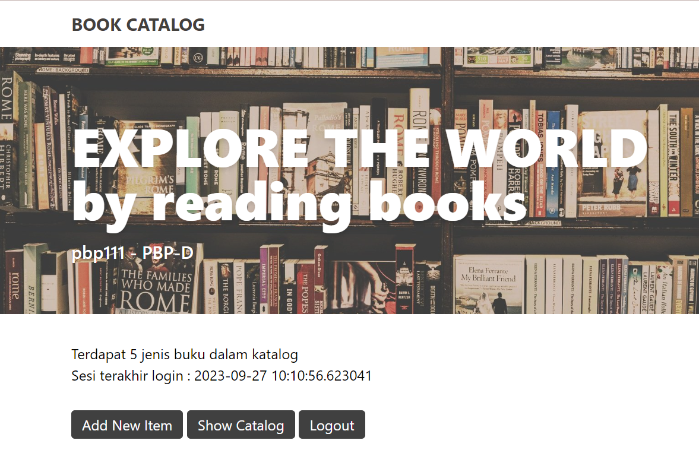
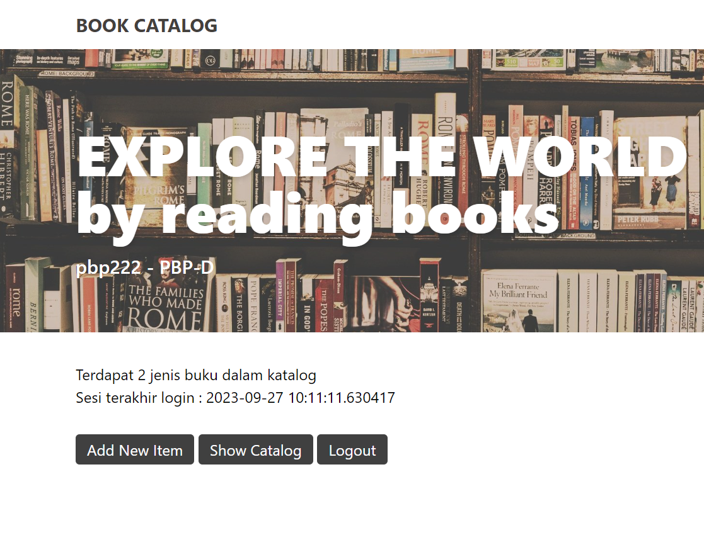

# **BOOK CATALOG**
https://book-catalog.adaptable.app

---

## How I implement the checklists step by step
<details>
<summary> (2) Make a new Django project.</summary>
<br>
    
1. Make local directory named `book_catalog` then open terminal on that directory path.
2. Make *virtual environment* to isolate *packages* and *dependencies* used on this project.
    ```
    python -m venv env
    ```
3. Activate the virtual environment.
    ```
    env\Scripts\activate.bat
    ```
4. Make `requirements.txt` in the directory filled with dependencies will be used on this project:
    ```
    django
    gunicorn
    whitenoise
    psycopg2-binary
    requests
    urllib3
    ```
5. Install the dependencies.
    ```
    pip install -r requirements.txt
    ```
6. Make a new Django project.
    ```
    django-admin startproject book_catalog .
    ```
7. Open `settings.py` then add `*` on `ALLOWED_HOSTS` so the project can be deployed like following code:
    ```
    ...
    ALLOWED_HOSTS = ["*"]
    ...
    ```
    
### Push project to GitHub repository
1. Make new public GitHub repository named `book_catalog`.
2. Initiate `book_catalog` local directory by running the following command on terminal:
    ```
    git init
    ```
3. Make new repository branch named `main` on terminal by:
    ```
    git branch -M main
    ```
5. Create a new file in `book_catalog` local directory named `.gitignore` filled with following text:
    ```
    # Django
    *.log
    *.pot
    *.pyc
    __pycache__
    db.sqlite3
    media

    # Backup files
    *.bak 

    # If you are using PyCharm
    # User-specific stuff
    .idea/**/workspace.xml
    .idea/**/tasks.xml
    .idea/**/usage.statistics.xml
    .idea/**/dictionaries
    .idea/**/shelf

    # AWS User-specific
    .idea/**/aws.xml

    # Generated files
    .idea/**/contentModel.xml

    # Sensitive or high-churn files
    .idea/**/dataSources/
    .idea/**/dataSources.ids
    .idea/**/dataSources.local.xml
    .idea/**/sqlDataSources.xml
    .idea/**/dynamic.xml
    .idea/**/uiDesigner.xml
    .idea/**/dbnavigator.xml

    # Gradle
    .idea/**/gradle.xml
    .idea/**/libraries

    # File-based project format
    *.iws

    # IntelliJ
    out/

    # JIRA plugin
    atlassian-ide-plugin.xml

    # Python
    *.py[cod] 
    *$py.class 

    # Distribution / packaging 
    .Python build/ 
    develop-eggs/ 
    dist/ 
    downloads/ 
    eggs/ 
    .eggs/ 
    lib/ 
    lib64/ 
    parts/ 
    sdist/ 
    var/ 
    wheels/ 
    *.egg-info/ 
    .installed.cfg 
    *.egg 
    *.manifest 
    *.spec 

    # Installer logs 
    pip-log.txt 
    pip-delete-this-directory.txt 

    # Unit test / coverage reports 
    htmlcov/ 
    .tox/ 
    .coverage 
    .coverage.* 
    .cache 
    .pytest_cache/ 
    nosetests.xml 
    coverage.xml 
    *.cover 
    .hypothesis/ 

    # Jupyter Notebook 
    .ipynb_checkpoints 

    # pyenv 
    .python-version 

    # celery 
    celerybeat-schedule.* 

    # SageMath parsed files 
    *.sage.py 

    # Environments 
    .env 
    .venv 
    env/ 
    venv/ 
    ENV/ 
    env.bak/ 
    venv.bak/ 

    # mkdocs documentation 
    /site 

    # mypy 
    .mypy_cache/ 

    # Sublime Text
    *.tmlanguage.cache 
    *.tmPreferences.cache 
    *.stTheme.cache 
    *.sublime-workspace 
    *.sublime-project 

    # sftp configuration file 
    sftp-config.json 

    # Package control specific files Package 
    Control.last-run 
    Control.ca-list 
    Control.ca-bundle 
    Control.system-ca-bundle 
    GitHub.sublime-settings 

    # Visual Studio Code
    .vscode/* 
    !.vscode/settings.json 
    !.vscode/tasks.json 
    !.vscode/launch.json 
    !.vscode/extensions.json 
    .history
    ```
    `.gitignore` file added so Git repository ignores files or and directories and doesn't commit them.
4. Add all those new files.
    ```
    git add .
    ```
5. Commit them.
    ```
    git commit -m "initial commit"
    ```
6. Push them to main Git repository.
    ```
    git push -u origin main
    ```
</details>
    
<details>
<summary>(2) Create project application and configure the URL routing</summary>
<br>
    
#### Create project application named `'main'`
1. Run following command to create new app named `'main'` on terminal:
    ```
    python manage.py startapp main
    ```
    After the command run, a new directory named `main` as a base structure of the application will be created.
    
2. To register the new application to the project, open `settings.py` in the `book_catalog` directory then add `'main'` on the `INSTALLED_APPS` like following code:
    ```
    INSTALLED_APPS = [
        ...,
        'main',
        ...
    ]
    ```

#### Configuring the URL Routing
URL routing needed so the `main` application can be accessed via web browser.
1. Create `urls.py` inside the `main` directory then write this following code:
    ```
    from django.urls import path
    from main.views import show_main

    app_name = 'main'

    urlpatterns = [
        path('', show_main, name='show_main'),
    ]
    ```
    It defines the URL pattern of `main` application by declaring the path with *app_name* on the URL and will display *show_main*.
</details>

<details>
<summary>(2) Implement Model, Template, and connect it with View</summary>
<br>
    
#### Implement Model    
1. Fill `models.py` on `main` application directory to define new model with following code:
    ```
    from django.db import models

    class Item(models.Model):
        name = models.CharField(max_length=255)
        amount = models.IntegerField()
        description = models.TextField()
    ```
    *item* is the name of the model with 3 attributes; name(Character), amount(Integer), and description(Text).
    
2. Make migration file filled with model changes named `makemigrations` by:
    ```
    python manage.py makemigrations
    ```
3. Run the following command to apply migration into the local database:
    ```
    python manage.py migrate
    ```
    Migration is how Django detect changes on datas and will change the data based on the model we define.
    
#### Implement *Template*
1. Create new directory named `templates` in `main` application directory
2. In the `templates` directory, create new file named `main.html` then write this following code:
    ```
    <h1>{{application_name}}</h1>
    <p>{{name}} - {{class}}</p>
    ```
    Template is how will the data shown on the browser. Template can be edited and supported with other styling Frameworks.
    
#### Connect `View` with `Template`
1. Open `views.py` inside main directory
then add the following code:
    ```
    from django.shortcuts import render

    def show_main(request):
        context = {
            'application': 'Book Catalog',
            'name': 'Eudora Vanya Lindsay',
            'class': 'PBP-D'
        }

    return render(request, "main.html", context)
    ```
    The purpose of the code is to take HTTP request  sent by user then render `main.html` with the data given in context. 
</details>

<details>
<summary>(2) Configure project URL routing</summary>
<br>

1. Inside `book_catalog` directory, open `urls.py` then import `include` function to import URL route from `main` application, like following:
    ```
    ...
    from django.urls import path, include
    ...
    urlpatterns = [
        ...
        path('main/', include('main.urls')),
        ...
    ]
    ```
    `main/` will redirect to route that's defined on `urls.py` inside `main` directory.
</details>
    
<details>
<summary>(2) Open project and deploy to Adaptable</summary>
<br>
    
#### Open the Django project on browser
1. Open the project by running the following command on terminal.
    ```
    python manage.py runserver
    ```
    Then open `http://localhost:8000/main` on browser to see the project result.

#### Deploy project to Adaptable    
1. Sign in to Adaptable then open the Dashboard.
2. Create `new App` then choose `Connect an Existing Repository`.
3. Choose `book_catalog` repository and `main` branch to deploy.
4. Choose `Python App Template` then `PostgreSQL`.
5. Change the Python version (mine is 3.11) and fill the `Start Command` with the following command `python manage.py migrate && gunicorn book_catalog.wsgi`.
6. Type the application name to be the web domain (mine is `book-catalog`).
7. Tick the `HTTP Listener on PORT` then deploy.
</details>

<details>
<summary>(2) Add testing</summary>
<br>

To check some of the functionality, testing is added on `tests.py` inside `main` directory.
### Add import
    from django.test import TestCase, Client
    from .models import Item
### Add testing
    class modelTest(TestCase):
        def test_main_url_is_exist(self):
            response = Client().get('/main/')
            self.assertEqual(response.status_code, 200)

        def test_main_using_main_template(self):
            response = Client().get('/main/')
            self.assertTemplateUsed(response, 'main.html')
I also added a new testing in the class to check if the object exist in the database.
  ```
 def test_object_exist(self):
        name_object = Item.objects.create(name='Buku 1', amount=10, description='Ini buku 1')
        name_object_exist = Item.objects.filter(name="Buku 1").exists()
        self.assertTrue(name_object_exist)
```
</details>

<details>
<summary>(3) Skeleton as View's Structure</summary>
Skeleton is needed to make sure our code on displaying data is consistent.

1. Create a file named `base.html` inside `templates` folder in the root directory and move some of the code in `main.html` there.

    ```
    
    <!DOCTYPE html>
    <html lang="en">
        <head>
            <meta charset="UTF-8" />
            <meta
                name="viewport"
                content="width=device-width, initial-scale=1.0"
            />
            <script src="https://cdn.tailwindcss.com"></script>
            
            
        </head>

        <body>
            
            
        </body>
    </html>
    ```
    
2. Add `'DIRS': [BASE_DIR / 'templates'],` in `settings.py` inside `book_catalog` directory
</details>

<details>
<summary>(3) Data input form and display data in HTML</summary>

1. Create `forms.py` inside `main` directory
    ```
    from django.forms import ModelForm
    from main.models import Item
    class ItemForm(ModelForm):
        class Meta:
            model = Item
            fields = ["name", "amount", "description"]
    ```

2. Add imports in `views.py` inside `main` directory.
    ```
    from django.http import HttpResponseRedirect
    from main.forms import ItemForm
    from django.urls import reverse
    from main.models import Item
    ```
3. Then add this following function to validate input, save to app's database, redirect page to `main` page, and add a new item when the form is submitted.
    ```
    def add_item(request):
    form = ItemForm(request.POST or None)

    if form.is_valid() and request.method == "POST":
        form.save()
        return HttpResponseRedirect(reverse('main:show_main'))

    context = {'form': form}
    return render(request, "add_item.html", context)

    ```
4. Then add `items = Item.objects.all()` on top of `show_main` function to fetch all `item` object inside database.
5. Import `add_item` from `main.views` in `urls.py`.
6. Add url patterns `path('add-item', add_item, name='add_item')` 
7. Create `add_item.html` in `templates` directory inside `main` folder.
    ```
     

    
    <h1>Add New Item</h1>

    <form method="POST">
        
        <table>
            {{ form.as_table }}
            <tr>
                <td></td>
                <td>
                    <input type="submit" value="Add Item"/>
                </td>
            </tr>
        </table>
    </form>

    
    ```
</details>

<details>
<summary>(3) Returning data as HTML</summary>

1. Create `show_html.html` inside `templates` directory in `main` folder as the template to display data saved in database.
    ```
     

    
    <table class="mx-20">
    <tr>
        <th>Name</th>
        <th>Amount</th>
        <th>Description</th>
    </tr>
    
    
        <tr>
            <td>{{item.name}}</td>
            <td>{{item.amount}}</td>
            <td>{{item.description}}</td>
        </tr>
    
    </table>
    
    ```
2. Make a new function inside `views.py` inside `main` directory
    ```
    def show_html(request):
        items = Item.objects.all()
        return render(request, 'show_html.html', {"items": items})
    ```
3. Add new url pattern inside `urls.py` in `main` directory
    ```
    path('add-item/', add_item, name='add_item')
    ```
</details>

<details>
<summary>(3) Returning data as XML and JSON</summary>

1. Add import in `views.py` inside `main` directory
    ```
    from django.http import HttpResponse
    from django.core import serializers
    ```
2. Inside the same file, make new functions
- XML
    ```
    def show_xml(request):
        data = Item.objects.all()
        return HttpResponse(serializers.serialize("xml", data), content_type="application/xml")
    ```
- XML by ID
    ```
    def show_xml_by_id(request, id):
        data = Item.objects.filter(pk=id)
        return HttpResponse(serializers.serialize("xml", data), content_type="application/xml")
    ```
- JSON
    ```
    def show_json(request):
        data = Item.objects.all()
        return HttpResponse(serializers.serialize("json", data), content_type="application/json")
    ```
- JSON by ID
    ```
    def show_json_by_id(request, id):
        data = Item.objects.filter(pk=id)
        return HttpResponse(serializers.serialize("json", data), content_type="application/json")
    ```
3. Add the name of the function as an import inside `urls.py` in `main` directory
    ```
    from main.views import show_html, show_xml, show_json, show_xml_by_id, show_json_by_id
    ```
4. Then make new url patterns
    ```
    path('html/', show_html, name='show_html'),
    path('xml/', show_xml, name='show_xml'),
    path('json/', show_json, name='show_json'),
    path('xml/<int:id>/', show_xml_by_id, name='show_xml_by_id'),
    path('json/<int:id>/', show_json_by_id, name='show_json_by_id'), 
    ```
</details>

<details>
<summary>(3) Add a message</summary>

1. Add this following code to show the message and amount of items in application
    ```
    <div class="my-5">
    <div class="mx-20 pt-3 flex">
        <p>Terdapat {{items.count}} jenis buku dalam katalog</p>
    </div>
    ```
    `items.count` show the amount of object saved in database.
</details>

<details>
<summary>(4) Registration, Login, and Logout</summary>

1. Activate virtual environment then add imports of redirect, UserCreationForm, messages, authenticate, login, and logout to make functions for register, login, logout, and login_required in views.py inside main directory 
2. Create function 
    `register` function to create user account when data is submitted
    ```
    def register(request):
    form = UserCreationForm()

    if request.method == "POST":
        form = UserCreationForm(request.POST)
        if form.is_valid():
            form.save()
            messages.success(request, 'Your account has been successfully created!')
            return redirect('main:login')
    context = {'form':form}
    return render(request, 'register.html', context)
    ```

    `login_user` function to authenticate user by data
    ```
    def login_user(request):
    if request.method == 'POST':
        username = request.POST.get('username')
        password = request.POST.get('password')
        user = authenticate(request, username=username, password=password)
        if user is not None:
            login(request, user)
            return redirect('main:show_main')
        else:
            messages.info(request, 'Sorry, incorrect username or password. Please try again.')
    context = {}
    return render(request, 'login.html', context)
    ```

    `logout_user` function to log out user
    ```
    def logout_user(request):
    logout(request)
    return redirect('main:login')
    ```
3. Create `register.html` inside main/templates to create register form
    ```
    

    
        <title>Register</title>
    

      

    <div class = "login">
        
        <h1>Register</h1>  

            <form method="POST" >  
                  
                <table>  
                    {{ form.as_table }}  
                    <tr>  
                        <td></td>
                        <td><input type="submit" name="submit" value="Daftar"/></td>  
                    </tr>  
                </table>  
            </form>

          
            <ul>   
                  
                    <li>{{ message }}</li>  
                      
            </ul>   
        

    </div>  

    
    ```
4. Create `login.html` to create login form
    ```
    

    
        <title>Login</title>
    

    

    <div class = "login">

        <h1>Login</h1>

        <form method="POST" action="">
            
            <table>
                <tr>
                    <td>Username: </td>
                    <td><input type="text" name="username" placeholder="Username" class="form-control"></td>
                </tr>
                        
                <tr>
                    <td>Password: </td>
                    <td><input type="password" name="password" placeholder="Password" class="form-control"></td>
                </tr>

                <tr>
                    <td></td>
                    <td><input class="btn login_btn" type="submit" value="Login"></td>
                </tr>
            </table>
        </form>

        
            <ul>
                
                    <li>{{ message }}</li>
                
            </ul>
             
            
        Don't have an account yet? <a href="">Register Now</a>

    </div>

    
    ```

5. Create a logout button inside `main.html`
    ```
    <a href="">
        <button>
            Logout
        </button>
    </a>
    ```

6. Import `register`, `login_user`, `logout_user` function in urls.py then add new path
    ```
    path('register/', register, name='register'),
    path('login/', login_user, name='login'),
    path('logout/', logout_user, name='logout'),
    ```

7. Add `@login_required(login_url='/login')` before `show_main` function inside `views.py` to restrict access to main page only to authenticated user
</details>

<details>
<summary>(4) Display logged-in user information</summary>

1. Import `HttpResponseRedirect`, `reverse`, and `datetime` in `views.py` inside `main` directory
2. Modify `login_user` code to set cookies each time user logged in
    ```
    ...
    if user is not None:
        login(request, user)
        response = HttpResponseRedirect(reverse("main:show_main")) 
        response.set_cookie('last_login', str(datetime.datetime.now()))
        return response
    ...
    ```

3. Add `'last_login': request.COOKIES['last_login'],` in `show_main` function context
4. Modify `logout_user` function to delete cookie saved as the user logged out
    ```
    def logout_user(request):
        logout(request)
        response = HttpResponseRedirect(reverse('main:login'))
        response.delete_cookie('last_login')
        return response
    ```

5. Add `<p>Last login session: {{ last_login }}</p>` inside `main.html` to display the last login information
</details>

<details>
<summary>(4) Connect Item model with user</summary>

1. Import user inside `models.py` inside `main` directory
2. Add `user = models.ForeignKey(User, on_delete=models.CASCADE)` inside Item model to connect each item with a user
3. Modify code inside `add_item` inside `views.py` to allow user modify the object before saving and prevent auto save
    ```
    def add_item(request):
        form = ItemForm(request.POST or None)

        if form.is_valid() and request.method == "POST":
            item = form.save(commit=False)
            item.user = request.user
            item.save()
            return HttpResponseRedirect(reverse('main:show_main'))
    ...
    ```

4. Modify `show_main` function to display name as user username and to filter item only the user added items
    ```
    def show_main(request):
        items = Item.objects.filter(user=request.user)
        context = {
            'name' : request.user.username,
            ...
        }
    ```
    
</details>

<details>
<summary>(4) Make dummy users</summary>
User 1 punya 5 jenis buku

User 2 punya 3 jenis buku

</details>

<details>
<summary>Current Notes</summary>
<br>

View and template on tutorial above were made based on the task requirements, I added other contexts and elements afterwards. I also edited the templates and added Tailwind script to do the styling of HTML page. :D
    
note : (n) for assigment n
</details>

---

### Django diagram about client request to the application web and the response.


<details>
<summary>Diagram explanation</summary>

#### Django uses MVT (Model-View-Template) Architecture
**Model (models.py)**  : Model manages data logic, interacts with database, and defines the application's data structure of database.

**View (views.py)** : View process user request by interacting with Model to retrieve, update, and manipulate data. View also interact with Template to render the view.

**Template** : Template defines the structure and layout of the UI and generate it to be presented to the user by rendering view as an HTML file as the return of the user request.

**`urls.py`** : `urls.py` defines the URL pattern for the web application and map to application view.

**HTML file** : HTML defines the UI structure, layout, and presentation of content on web pages rendered by web browser/client and displays content to users.
</details>

---

### Why do we use virtual environment and can we make Django web application without a virtual environment?
Virtual environment is a tool provided by Python to make an environment isolating Python version, packages, dependencies, etc owned by the project. Each project can has its own virtual environment to make sure the packages, dependencies, or Python version do not crash with other projects'. We can still make a Django project without a virtual environment, however it is recommended to use virtual environment to prevent various issues such as projects conflict.

---

### What are MVC, MVT, MVVM, and the differences?

<details>
<summary>MVC (Model-View-Controller)</summary>
<br>
    
Model handles the data logic through interaction with database then pass it to View to be displayed to the user. Controller handles the request flow by end user and acts as an interemediary between Model and View. Controller interacts with Model to fetch data then decide the View to render the data. View will present the data to the user by generating UI.
</details>

<details>
<summary>MVT (Model-View-Template)</summary>
<br>
    
Model manages data by interacting with database and represents the application's data structure. View process user request and interacts with Model to fetch and or update data. View then decide the Template will be used to render the response (HTTP response) as the return of the user request.
</details>

<details>
<summary>MVVM (Model-View-ViewModel)</summary>
<br>
    
Model manage the data logic then notifies changes to ViewModel by binding/events. ViewModel is a intermediary between Model and View. It exposes data to View and it will display the data using UI components. In MVVM, View is focusing only on displaying the data and ViewModel will take the role of providing data and behavior the View needed.
</details>

<details>
<summary>The differences</summary>
<br>

**MVC** : Controller is the entry point to the application and will control request flow and communication between Model and View.

**MVT** : Component that works like an 'controller' is abstracted and handled by the framework. It will control the request flow, connect Model with View, routing request to View, and handling HTTP request/response from/to user.

**MVVM** : ViewModel is the entry point to the application managing application's behavior and data to be presented.    
</details>

---

### What is the difference between POST form and GET form in Django?
<details>
<summary>POST form</summary>

POST form is a HTTP method of Django form to do any request that change the state of the system like adding item to the database. Post method offers more control over access for example CSRF protection used on `add_item.html` to prevent malicious attacks.
</details>

<details>
<summary>GET form</summary>

GET form is a HTTP method of Django form to bundle submitted data into string and use them to compose URL. In this project, get method used to take the data saved on database and pass them to be displayed to user.
</details>

---

### What are the main differences between XML, JSON, and HTML in the context of data delivery?
<details>
<summary>XML</summary>
    
XML : more flexible and secure but much more difficult to parse than JSON and is more complex. XML data structure use nested elements, for example:
    ```
    <person>
        <name>Vanya</name>
    </person>
    ```
</details>

<details>
<summary>JSON</summary>

JSON : easier, faster, parsed into a ready-to-use JS object, smaller file size, but limited data type and no metadata. JSON data structure use key-value pair, for example:
    
```{"name" : "Vanya"}```
</details>

<details>
<summary>HTML</summary>

HTML : content is structured, easier to render, support media like images and videos, but HTML used to render web content so it may not be relevant for transferring pure data and more complex to render because of the structure. HTML uses HTML tags to display data such as
    
```<p>Vanya</p>```
</details>

---

### Why is JSON often used in data exchange between modern web applications?
JSON is designed with simple key-value pair structure making it has a more readable format data structure and easier to understand. In modern web application, efficiency is needed to improve performance and speed of displaying data. JSON provides it with built-in support or libraries for parsing JSON data making it easier on transfering data with minimum data size. Through its feature and wide range of technologies, JSON is needed and used on modern web application.

### Access the five URLs in point 2 using Postman, take screenshots of the results in Postman, and add them to README.md.
<details>
<summary>HTML</summary>


</details>

<details>
<summary>XML</summary>

</details>

<details>
<summary>XML by ID</summary>

</details>

<details>
<summary>JSON</summary>

</details>

<details>
<summary>JSON by ID</summary>

</details>

### What is UserCreationForm in Django? Explain its advantages and disadvantages.
UserCreationForm is a build-in module of ModelForm used for creating users that can use the application. It receives 3 fields which are username, password, and password confirmation and it automatically generates POST request and create new user when user hit 'Register' button. The advantages of UserCreationForm is it's already provided by Django so the developer doesn't need to build it from the scratch. The form itself has handled some basic aspect such as styling, receiving user data, validating the input and form, and automatically save data to database. The drawback of this module is it doesn't have email field used to send email verification/confirmation and it doesn't provide the view to handle the user creation so developers need to create the function themselves.

### What is the difference between authentication and authorization in Django application? Why are both important?
<details>
<summary>Authentication</summary>

Authentication is the process of verifying the user and knowing the identity of the user by processing the username and password input. Authentication is supported by Django by providing models, forms, and views to process user activity(register/login/logout). 
</details>

<details>
<summary>Authorization</summary>

Authorization determines specific application, files, data, and actions the authenticated user has access to. It's built on top of authentication system and uses user permission to control access to functionalities.
</details>

### What are cookies in website? How does Django use cookies to manage user session data?
Cookies are small blocks of data created by web server sent to user's device. It is usually used to remember information such as user preference, visit, session, behavior, etc. Django uses cookies to manage user session data by generating unique session ID for the user then store it as a cookie in the user's web browser. ID used for user authentication and authorization and will expire when the user closes their web browser.

### Are cookies secure to use? Is there potential risk to be aware of?
Cookies are generally secure to use but there are potential risk related to data privacy since cookies can store user data such as session hijacking, tracking, cookies theft, CSRF attack, etc. Though cookies pose minimal security risks, it's essential for developer to implement proper security and for user to be aware of privacy concern.